  

<h3>
<code>sachin@github ~ $ ./contributions.sh</code>
</h3>

  

<h3>
<code>sachin@github ~ $ whoami</code>
</h3>

AI &amp; Data Science Engineer - Full Stack AI - RAG - LLMs

---

### `sachin@github ~ $ cat about.txt`

## > about

I'm a **Junior Full Stack AI Engineer** focused on building intelligent applications with **Generative AI, RAG, semantic search, and modern full-stack technologies**.

I enjoy turning complex problems into practical AI-powered products - from document intelligence and talent matching to intelligent search and automation.

---

### `sachin@github ~ $ cat skills.txt`

## > skills

**Languages**

`Python` `JavaScript` `TypeScript` `SQL`

**AI / GenAI**

`LLMs` `RAG` `LangChain` `LangGraph` `Claude API` `OpenAI API`

`Prompt Engineering` `Embeddings` `Semantic Search` `Reranking`

`Vector Databases` `NLP` `Computer Vision`

**Frameworks**

`React` `Flask` `TensorFlow` `PyTorch` `Scikit-learn` `OpenCV`

**Databases / Infrastructure**

`MongoDB` `Pinecone` `Redis` `Docker` `Kubernetes` `AWS`

**Developer Tools**

`Git` `GitHub` `REST APIs` `Socket.IO` `JWT`

---

### `sachin@github ~ $ cat experience.txt`

## > experience

### Junior Full Stack AI Engineer - Budhhi Technologies

Building AI-powered full-stack applications involving:

- AI profile matching
- Semantic search
- NLP-based resume parsing
- ATS scoring
- AI workflows
- Backend APIs
- React-based interfaces
- MongoDB data systems
- OpenAI-powered applications
- Pinecone vector search

---

### `sachin@github ~ $ ls projects/`

## > projects

### DocuTrust - AI Document Intelligence

RAG-powered document intelligence platform using LLMs, embeddings, vector search and NLP to retrieve and understand information from documents.

### AI-Powered Talent Matching Platform

Full-stack AI platform for intelligent candidate matching, semantic search, resume parsing and ATS scoring.

### AI Assistant for Visual Learning

Multimodal learning assistant combining speech-to-text, computer vision, OCR and summarization to transform educational videos into structured learning content.

### Stock Price Prediction

Machine learning project using LSTM-based time-series prediction techniques for stock market analysis.

### Real-Time Face Detection

Computer vision application using OpenCV and Haar Cascade-based face detection.

---

### `sachin@github ~ $ cat education.txt`

## > education

**B.E. Artificial Intelligence & Data Science**

Global Academy of Technology, Bengaluru

CGPA: **9.07 / 10**

---

### `sachin@github ~ $ git status`

 

**STATUS: ONLINE**

 

`AI` `RAG` `LLMs` `Full Stack` `Automation` `Semantic Search` `Generative AI`

  

<code>sachin@github ~ $ echo "let's build something intelligent."</code>

  

**Thanks for visiting my profile.**

